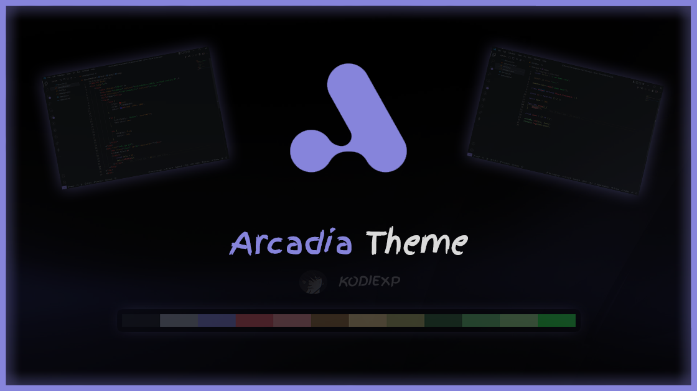
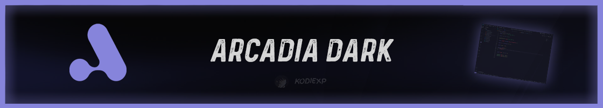
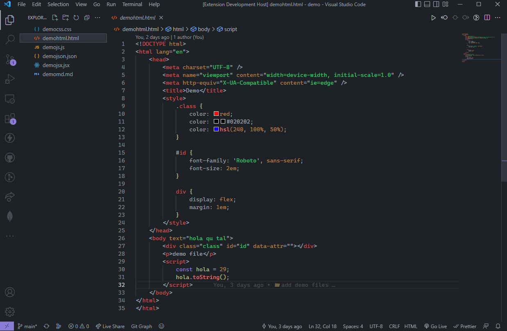
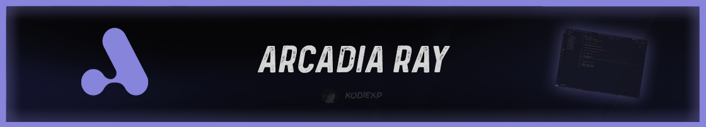
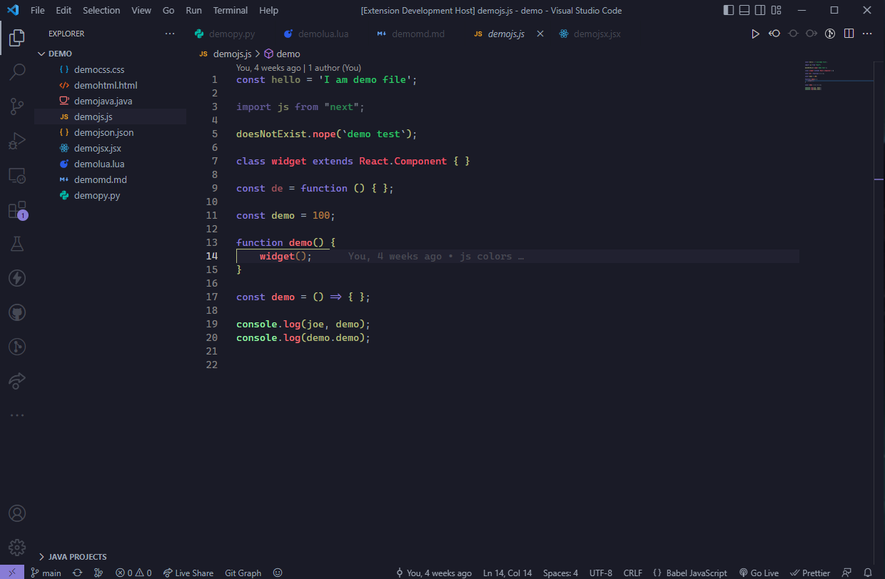
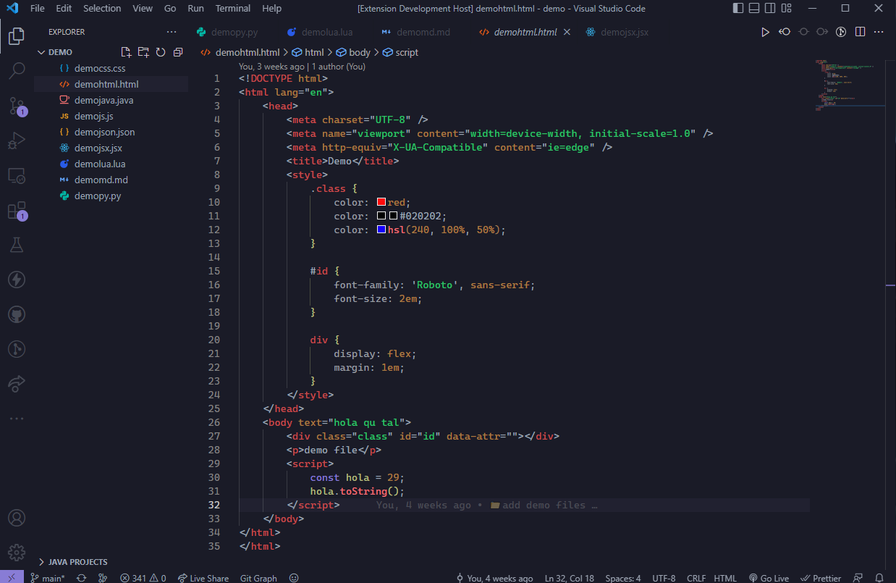

<p align="center">

</p>

<p align="center">
    <a href="https://github.com/motidev/arcadia-theme"></a>&nbsp;
    <a href="https://github.com/motidev/arcadia-theme"></a>&nbsp;
    <a href="https://github.com/motidev/arcadia-theme"></a>&nbsp;
</p>

### 📋 Description
A beautiful dark theme for VsCode. You can visit [**Github Repo**](https://github.com/motidev/arcadia-theme) 💜

Preview in web [**here**](https://vscode.dev/theme/Kodi.arcadia-theme)

You can report bugs [**here**](https://github.com/motidev/arcadia-theme/issues) or Support [**here**](https://discord.gg/MkTvbu9gva)
&nbsp;
### 📝 Changelog
**Version 1.0.1 | 29/11/2022**
  - Update readme.
  - Add Preview (web).
  - Add **python** support
  - Left the beta **Version**

**Version 1.1.2 | 03/12/2022**
  - Update [banner](public/images/banner1.png)

**Version 1.1.4 | 03/12/2022**
  - Update terminal color

**Version 1.2.4 | 04/12/2022**
  - Change color debugToolBar
  - Add Arcadia Ray
  - Change color in arcadia dark(list , button , focusborder)
  - Update readme(image)

**Version 1.2.5 | 04/12/2022**
  - Change images

**Version 1.2.6 | 04/12/2022**
  - Change logo

[**More info**](https://github.com/motidev/arcadia-theme/blob/main/Changelog.md)
&nbsp;

<p align="center">
  
</p>
  
  <br>
  

&nbsp;

<p align="center">
  
</p>

  <br>


&nbsp;
### 📥 Installation  
  ```jsonc

    1. Open the Extensions sidebar in VS Code 

    2. Search for Arcadia Theme

    3. Click Install

    4. Open the Command Palette with Ctrl+Shift+P 
    
    5. Select Preferences: Color Theme and choose a Arcadia Theme.

   ```

Visit the extension [**marketplace**](https://marketplace.visualstudio.com/items?itemName=Kodi.arcadia-theme)
&nbsp;
### ⚙ Recommended Settings 
  ```jsonc

    "VsCode": {
        "workbench.colorTheme": "Arcadia Theme",
        "editor.fontSize": "14px",
        "editor.fontFamily": "Cascadia Code PL"
    }

  ```

Download the [**Cascadia Code Font**](https://github.com/microsoft/cascadia-code/releases).
&nbsp;
### 🎨 Palette
**Colors of the extension**

  

  See [**here**](https://github.com/motidev/arcadia-theme/blob/main/public/images/arcadiapalette.png)
&nbsp;
### 🔖 License

You can see the [**License**](https://github.com/motidev/arcadia-theme/blob/main/LICENSE)
&nbsp;
### 🤟 Thanks
    If you like this extension, you could give a ⭐.
&nbsp;
<p align="center"><b>© 2022 Motidev. All rights reserved</b></p>

<p align="center">
  <a href="https://discord.gg/MkTvbu9gva"></a>
</p>


