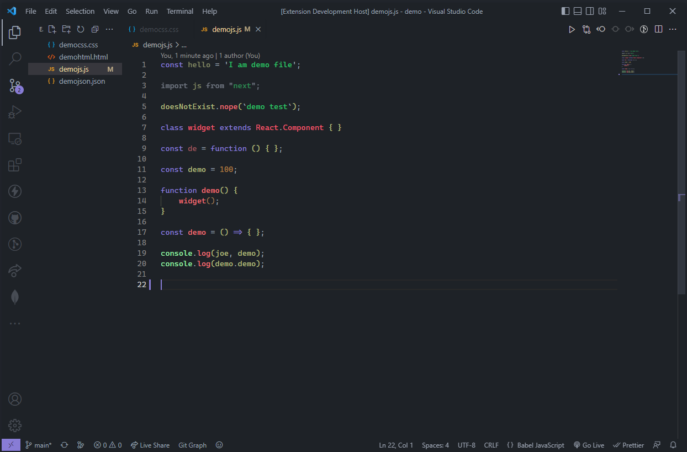

<p align="center" >
    
</p>

<p align="center">
    <a href="https://github.com/kodiexp/arcadia-theme"></a>&nbsp;
    <a href="https://github.com/kodiexp/arcadia-theme"></a>&nbsp;
    <a href="https://github.com/kodiexp/arcadia-theme"></a>&nbsp;
</p>

### 📋 Description
A beautiful dark theme for VsCode. You can visit [**Github Repo**](https://github.com/kodiexp/arcadia-theme) 💜

You can report bugs [**here**](https://github.com/kodiexp/arcadia-theme/issues)
&nbsp;
### 📝 Changelog
**Version 0.0.2**
  - This extension is currently under development. 

**Version 0.0.3**
  - Trial version.

[**More info**](https://github.com/kodiexp/arcadia-theme/blob/main/Changelog.md)
&nbsp;
### 📷 Pictures



&nbsp;
### 📥 Installation
 **1.**  Open the Extensions sidebar in VS Code or enter [**here**]()

 **2.**  Search for Arcadia Theme

 **3.**  Click Install

 **4.**  Open the Command Palette with Ctrl+Shift+P or ⇧⌘P
 
 **5.**  Select Preferences: Color Theme and choose a Arcadia Theme.
&nbsp;
### ⚙ Recommended Settings 
  ```jsonc

    "VsCode": {
        "workbench.colorTheme": "Arcadia Theme",
        "editor.fontSize": "14px",
        "editor.fontFamily": "Cascadia Code PL"
    }

  ```

Download the [**Cascadia Code Font**](https://github.com/microsoft/cascadia-code/releases).
&nbsp;
### 🎨 Palette
**Colors of the extension**

  
&nbsp;

### 🔖 License

You can see the [**License**](https://github.com/kodiexp/arcadia-theme/blob/main/LICENSE)
&nbsp;
### Thanks

    If you like this extension, you could give a ⭐.
&nbsp;


